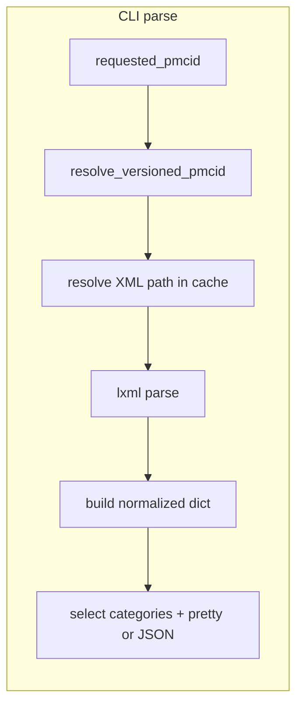

# CLI `parse`: cached XML extraction (normalized article dict)

## Constraints discovered

- **XML path**: After `resolve_versioned_pmcid()` ([`storage_utils.resolve_versioned_pmcid`](src/pmc_toolkit/storage_utils.py)), the OA dataset stores XML at `{versioned_pmcid}/{versioned_pmcid}.xml`; locally that is [`cache.local_object_path`](src/pmc_toolkit/cache.py) → `<cache_root>/<PMCid.N>/<PMCid.N>.xml` (see [`tests/test_storage.py`](tests/test_storage.py)).
- **`pyeuropepmc` package**: Cannot be added as a runtime dependency: it pins `typer>=0.12.5,<0.13.0` while this project uses **`typer>=0.24.1`**. It also pulls a large stack (matplotlib, flask, rdflib, linkml, …). **Approach**: implement extraction in-repo with **`lxml.etree`**, taking XML parsing mechanics from the lighter pubmed_parser style and returning stable dict/list categories.
- **Dependency note**: add `lxml` as the only XML parsing runtime dependency. Do **not** add `defusedxml`.
- **Parser safety note**: Use an `lxml.etree.XMLParser` configured for cached PMC XML, e.g. `resolve_entities=False`, `no_network=True`, and avoid DTD loading/validation. The input comes from the local fetch cache, but parser options should still avoid external entity expansion and network access.

## Target schema (default parse output)

Parse once into a normalized dictionary. The output should be comprehensive enough for normal use, but not a lossless XML mirror. Use readable category names instead of public JATS names like `body` and `back`.

| Category | Meaning |
|----------|---------|
| `source` | versioned PMCID and local XML path |
| `title` | article title as a simple top-level value |
| `journal` | journal identifiers, title, ISSNs, publisher |
| `article` | article identifiers, title, type/language, authors, dates, volume/issue/pages, keywords, categories, permissions, funding |
| `affiliations` | author affiliation text keyed by XML IDs referenced from authors |
| `author_notes` | author contribution notes and correspondence |
| `related_articles` | related publication links and identifiers |
| `custom_metadata` | PMC custom metadata key/value pairs |
| `abstract` | abstract text and optional structured abstract sections |
| `content` | article sections, nested headings, paragraphs, and citation/figure/table xref IDs |
| `acknowledgements` | acknowledgement sections from article back matter |
| `data_availability` | data availability statements |
| `competing_interests` | competing interest statements |
| `supplementary_media` | supplementary media descriptions and links |
| `references` | bibliography entries from `<ref-list>` |
| `figures` | figure labels, captions, and graphics |
| `tables` | table labels, captions, rows, and footnotes |

**Scope note**: Implement helpers analogous to PyEuropePMC’s `_extract_with_fallbacks`, `extract_elements_by_patterns` (simplified: list of XPath strings per field), and [`XMLHelper.combine_page_range`](https://github.com/JonasHeinickeBio/pyEuropePMC/blob/main/src/pyeuropepmc/processing/utils/xml_helpers.py) for `pages`. With `lxml`, prefer `.xpath(...)` where attribute predicates or namespace-agnostic matching make the extraction clearer.

**V1 schema contract**:

```python
{
    "source": dict[str, str],
    "title": str | None,
    "journal": dict[str, Any],
    "article": dict[str, Any],
    "affiliations": list[dict[str, Any]],
    "author_notes": dict[str, Any],
    "related_articles": list[dict[str, Any]],
    "custom_metadata": dict[str, str],
    "abstract": dict[str, Any],
    "content": dict[str, Any],
    "acknowledgements": list[dict[str, Any]],
    "data_availability": list[dict[str, Any]],
    "competing_interests": list[dict[str, Any]],
    "supplementary_media": list[dict[str, Any]],
    "references": list[dict[str, Any]],
    "figures": list[dict[str, Any]],
    "tables": list[dict[str, Any]],
}
```

## CLI UX ([`src/pmc_toolkit/cli.py`](src/pmc_toolkit/cli.py))

- **Command**: `parse`
- **Argument**: `requested_pmcid` — same validation path as `fetch` via `storage_utils.resolve_versioned_pmcid` + [`validators.parse_pmcid`](src/pmc_toolkit/validators.py).
- **Cache**: `--cache-dir` + `envvar="PMC_TOOLKIT_CACHE"` — mirror [`fetch`](src/pmc_toolkit/cli.py) exactly; use [`cache.resolve_cache_root`](src/pmc_toolkit/cache.py).
- **Selection flags** (all optional booleans; if none are passed, emit the full normalized dict):
  - `--source` → emit versioned PMCID and XML path.
  - `--title` → emit `data["title"]`.
  - `--journal` / `--journal-meta` → emit `data["journal"]`.
  - `--article` / `--article-meta` → emit `data["article"]`.
  - `--affiliations` → emit `data["affiliations"]`.
  - `--author-notes` → emit `data["author_notes"]`.
  - `--related-articles` → emit `data["related_articles"]`.
  - `--custom-metadata` → emit `data["custom_metadata"]`.
  - `--abstract` → emit `data["abstract"]`.
  - `--content` → emit `data["content"]`.
  - `--acknowledgements` → emit `data["acknowledgements"]`.
  - `--data-availability` → emit `data["data_availability"]`.
  - `--competing-interests` → emit `data["competing_interests"]`.
  - `--supplementary-media` → emit `data["supplementary_media"]`.
  - `--references` → emit `data["references"]`.
  - `--figures` → emit `data["figures"]`.
  - `--tables` → emit `data["tables"]`.

- **Output**:
  - Default: **human-readable** sections with clear labels (similar spirit to pretty printing `metadata` command lines 83–84 but grouped).
  - `--json`: single JSON object whose **top-level keys** match the selected categories.

- **Missing XML**: If `<cache>/<versioned>/<versioned>.xml` does not exist → **`ValueError`** with message instructing user to run **`fetch --ext xml <PMCID>`** first (and mention `--cache-dir` if relevant). Echo the resolved path in the error for debugging.

## Module layout (new code)

- Add [`src/pmc_toolkit/xml_parse_utils.py`](src/pmc_toolkit/xml_parse_utils.py) containing:
  - `load_xml(path: Path) -> etree._Element`
  - `extract_article_data(root: etree._Element) -> dict[str, Any]`
  - category helpers for `journal`, `article`, `affiliations`, `author_notes`, `related_articles`, `custom_metadata`, `abstract`, `content`, `acknowledgements`, `data_availability`, `competing_interests`, `supplementary_media`, `references`, `figures`, and `tables`
- Add a small parsing frontend in [`src/pmc_toolkit/xml_parse_api.py`](src/pmc_toolkit/xml_parse_api.py), e.g. `parse_cached_xml(...)`. Keep storage commands in `storage_api.py`; keep XML tree logic in `xml_parse_utils.py`; let `xml_parse_api.py` bridge cache-path resolution and XML extraction.
- Avoid naming the module `jats_parse.py`: the command consumes XML and should stay approachable even if future PMC files have JATS variants or non-obvious DTD names.



## Tests

- **Unit tests** with small inline XML strings (minimal JATS front/body/back) for: category keys, identifiers, journal title, title/abstract, affiliations, author notes, related articles, custom metadata, nested content headings, acknowledgements, data availability, competing interests, supplementary media, references, figures, and tables.
- **Integration**: reuse patterns from [`tests/test_storage.py`](tests/test_storage.py) — temp cache dir, touch `{PMC…}.{n}/{PMC…}.{n}.xml` with fixture content, invoke CLI or call parser function (avoid subprocess if tests already use Typer’s runner).

## Docs

- Update [`README.md`](README.md): `parse` examples, cache prerequisite, `--json`, flag combinations.
- Optional: add a short “parity” note in [`docs/jats-xml-parsing-reference.md`](docs/jats-xml-parsing-reference.md) pointing to PyEuropePMC `MetadataParser` as reference schema.

## Post-change verification

Run from repo root (per [`AGENTS.md`](AGENTS.md)): `uv run ty check && uv run ruff check . && uv run pytest -q`.
